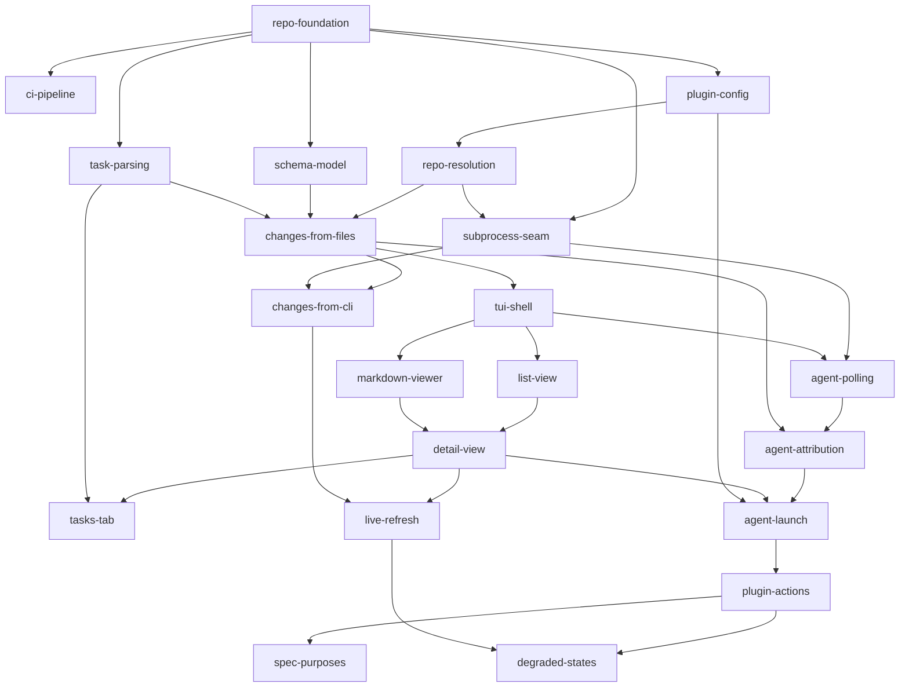

# Implementation Order

The roadmap from an empty scaffold to an installable Herdr plugin. Each row is one
OpenSpec change with its own proposal, specs, design, tasks, and planning-review under the
repository's `tdd` schema.

Read [SPEC.md](../SPEC.md) first — it is the contract every change below implements.
[PRD.md](../PRD.md) carries the requirements and the non-goals.

This is a plan, not a commitment. A change may split when its tasks turn out to carry
two kinds of work, or merge when a boundary proves imaginary. Update this file when
that happens rather than letting it drift.

## Ordering principles

- **Pure logic before the TUI.** Resolution, schema parsing, task parsing, and change
  loading are pure transformations with no terminal and no subprocess. They are built
  and fully tested before anything renders (SPEC → Architecture).
- **The subprocess seam exists before anything crosses it.** `OpenspecCli` and
  `HerdrCli` land as traits with fakes before the first change that shells out, so no
  test spawns the `openspec` or `herdr` binaries — `subprocess-seam`'s own tests spawn
  scratch `#!/bin/sh` programs at absolute paths to prove the seam itself, and
  `tests/cli.rs` spawns this crate's own binary; neither is what this principle
  guards against (SPEC → Architecture).
- **Files before the CLI.** The file-reading path is built first and stays the path
  that paints the pane. CLI enrichment is layered on top as an asynchronous
  correction, which keeps the fallback exercised on every launch rather than untested
  (SPEC → Data layer).
- **Dashboard before agents.** The plugin is useful the moment it can read a change.
  Agent awareness and launching are additive and land after the dashboard works.
- **Degrade at every step.** Each change handles its own empty and unavailable states
  as it goes; `degraded-states` closes the table rather than introducing the idea
  (PRD → Goal 5).
- **Dogfoodable from Phase 1.** `repo-foundation` ships a manifest that
  `herdr plugin link .` can load, so every later change can be seen running in a real
  pane.

---

## Phase 1 — Foundation

| Change | Scope | Spec refs | Depends on |
|---|---|---|---|
| `repo-foundation` | Cargo scaffold (binary `herdr-openspec`); `rustfmt.toml`; `Makefile` with a `check` target running format, lint, test, and coverage; `scripts/build.sh` sourcing `~/.cargo/env` before building; a minimal `herdr-plugin.toml` (`id`, `name`, `version`, `min_herdr_version`, `platforms`, `[[build]]`, the `dashboard` pane) so `herdr plugin link .` works from day one. | Build and distribution | — |
| `ci-pipeline` | GitHub Actions on `ubuntu-latest` and `macos-latest` with `Swatinem/rust-cache`. Required jobs: `cargo fmt --check`, `cargo clippy -D warnings`, `cargo test`. Coverage via `cargo llvm-cov --fail-under-lines 80`, Linux only. | Testing and quality gates | `repo-foundation` |
| `plugin-config` | Read `config.toml` from the directory Herdr injects as `HERDR_PLUGIN_CONFIG_DIR` (no subprocess; falls back to the same path `herdr plugin config-dir` reports when run outside a Herdr-started process): `openspec_bin`, `agent_kind`, `archived_count`. Absent file and absent keys fall back to defaults. Also the plugin-local state file — under `HERDR_PLUGIN_STATE_DIR`, separate from `config.toml` — that records the agent-name mapping whenever the derived name differs from the change name, not only when truncated. | Data layer → Resolution chain | `repo-foundation` |

## Phase 2 — Reading OpenSpec from disk

Pure transformations. No terminal, no subprocess, no writes.

| Change | Scope | Spec refs | Depends on |
|---|---|---|---|
| `repo-resolution` | `resolve` — walk up from a starting directory for `openspec/`, and the four-step `openspec` binary probe chain (config, `PATH`, nvm tree, `npm prefix -g`) with session caching. Step 4's `npm prefix -g` collaborator ships as an injected hook that always returns nothing; `subprocess-seam` replaces it. Tested against a purpose-built scratch directory tree, not a faked filesystem layer. | Data layer → Resolution chain | `plugin-config` |
| `schema-model` | `schema` — resolve the schema name from a change's own `.openspec.yaml`, then the project's `openspec/config.yaml` → `schema:`, then the default `spec-driven`; load `openspec/schemas/<name>/schema.yaml`; produce the ordered artifact list; and identify the tasks artifact by the schema's `apply.tracks` value, falling back to the id `tasks` when no `apply` block declares what it tracks. Carries a delta on `plugin-build`, since the change adds the crate's second dependency (`yaml-rust2`). | Data layer → Resolution chain | `repo-foundation` |
| `task-parsing` | `tasks` — parse a markdown task file into groups under their headings, items with checked state, and completion counts. | Data layer → Dual-source model (the counting-rule contract this change implements); User interface → Detail view (where `tasks-tab` later renders the result) | `repo-foundation`; its scratch-tree and containment tests also reuse `testutil::ScratchDir`/`testutil::snapshot` from `plugin-config`/`repo-resolution`, both already landed — no new Mermaid edge, since the dependency is on test *helpers* rather than a published contract |
| `changes-from-files` | `changes::from_files` — enumerate active changes from `openspec/changes/`, archived ones from `openspec/changes/archive/` (strip the `YYYY-MM-DD-` prefix, sort descending, take `archived_count`), and resolve each artifact's paths from its schema-declared `generates` value, never a path guessed from its id. Also consumes `Config::archived_count` from `plugin-config`, which reaches it transitively through `repo-resolution` and so adds no Mermaid edge below — noted so the absence is not read as an oversight. Produces the `Change` type the CLI path must also produce. | Data layer | `repo-resolution`, `schema-model`, `task-parsing` |

## Phase 3 — The subprocess seam

| Change | Scope | Spec refs | Depends on |
|---|---|---|---|
| `subprocess-seam` | `cli` — the `OpenspecCli` and `HerdrCli` traits, one real spawn-and-return-stdout implementation each, and the fakes used by every later test. No parsing lives here. Also replaces `resolve::npm_prefix_deferred` with a real binding that runs `npm prefix -g` behind the seam, reading its stdout only, trimmed — `npm` writes unrelated shell-plugin noise to stderr on the reference machine — and treating a non-zero exit or empty output as no prefix. This is an end-to-end obligation, not just a binding swap: a scenario must drive the real hook through to `<prefix>/bin/openspec`, since until this change lands that join is exercised only by fixture closures. | Architecture → The subprocess seam | `repo-foundation`, `repo-resolution` |
| `changes-from-cli` | `changes::from_cli` — parse `openspec list --json` and `openspec instructions apply --change <n> --json` (for `contextFiles`) into the same `Change` type, plus the merge policy that layers CLI results over file results. `openspec status --change <n> --json` is deliberately **not** run: it computes its per-artifact paths through the same `resolveArtifactOutputs` function `instructions apply`'s `contextFiles` already uses, so it supplies nothing new at the cost of a second Node start per change, and its own `artifacts` array is sorted in topological build order rather than the schema's declared order, so it would not even be a correct source for the positional join below. A schema the CLI rejects falls back to the file result for that change. Inherits two obligations from `changes-from-files`: join the two producers' artifact lists by **position** in the schema's declared order, never by path or by id (`schema-artifacts` forbids de-duplicating ids, and file-sourced paths are not canonicalized while the CLI's `contextFiles` paths are, so the strings legitimately differ); and re-sort the CLI's active-change list by name, since `openspec list --json` defaults to most-recently-modified first and the two producers must agree on one order. Also owns the schema CLI-fallback tier: when `schema::load` reports `LoadError::NotVendored`, ask `openspec schema which <name> --json` for the schema's directory (stdout is clean JSON; an "experimental" note goes to stderr) and read `schema.yaml` from there with the same parser — this covers the `$XDG_DATA_HOME` and package-built-in tiers a disk-only read cannot see. No direct `schema-model --> changes-from-cli` edge is added to the graph below: `schema-model --> changes-from-files --> changes-from-cli` already transitively satisfies this obligation. | Data layer → Dual-source model | `changes-from-files`, `subprocess-seam` |

## Phase 4 — The dashboard

| Change | Scope | Spec refs | Depends on |
|---|---|---|---|
| `tui-shell` | crossterm terminal setup and teardown, the ratatui event loop, quit handling, the 100-column responsive breakpoint, and the `TestBackend` harness that later view changes assert against. | User interface → Responsive layout | `changes-from-files` |
| `list-view` | The change list: one row per active change with progress, the archived separator and rows below it, selection and navigation, and `/` filtering. Empty states for no repository and no changes. Also renders repository-level `ChangeSet::problems` (e.g. an unreadable `openspec/changes/`) above the list, since no other change owns its leading rows. | User interface → List view; Degraded states | `tui-shell` |
| `markdown-viewer` | `pulldown-cmark` to ratatui text — headings, lists, code blocks, block quotes, thematic breaks, emphasis, links, images, and raw HTML — with scrolling. Carries a delta on `plugin-build`, since the change adds the crate's fifth dependency (`pulldown-cmark`). **BREAKING** — `j` / `k` and the arrows scroll the detail content at `Route::Detail` instead of moving the list selection there. | User interface → Detail view; Degraded states | `tui-shell` |
| `detail-view` | Change header (name, schema, progress), the artifact tab bar built from the schema's ordered artifacts, `1`–`9` / `[` / `]` tab switching, and the "No content yet" state for a missing artifact or a named reason for a failed read. | User interface → Detail view | `list-view`, `markdown-viewer` |
| `tasks-tab` | The tasks artifact rendered as grouped checkbox items with a progress bar, replacing the plain markdown view for that one tab. Read-only. | User interface → Detail view | `detail-view`, `task-parsing` |
| `live-refresh` | The `notify` 8.2.0 watcher (`default-features = false, features = ["macos_fsevent"]` — the crate's sixth dependency, +5 packages on macOS / +6 on Linux; `notify-debouncer-mini` was rejected in favor of a hand-rolled debounce) on `openspec/` with ~150ms debounce and per-change invalidation, the worker thread running CLI calls off the render path, and the `r` force-refresh key. `ui::run` wires both the watcher and the worker into the render loop via `crate::cli::worker_cli`/`worker_cli_from_env`, fixing a Change Review CRITICAL found during apply where neither had been started and the shipped binary's live tier would have been permanently inert. This is where the dual-source model becomes visible: files paint, the CLI corrects. | Data layer → Refresh | `detail-view`, `changes-from-cli` |

## Phase 5 — Herdr integration

| Change | Scope | Spec refs | Depends on |
|---|---|---|---|
| `agent-polling` | Poll `herdr agent list` at ~1s through the `cli::HerdrCli` seam and parse the result. The argument vector is exactly `["agent", "list"]` with **no `--json` flag** — Herdr 0.8.2 rejects that flag with exit status 2, and the command already emits a `{"id":…,"result":{"agents":[…],"type":"agent_list"}}` **envelope** rather than the bare array `SPEC.md` described; the change corrects `SPEC.md` against the running binary, including the `name` field it omitted and the JSON reason an unreachable socket prints on stderr. An unreachable socket stays a supported state, not an error: the plugin runs as a standalone TUI with agent features absent. Adds `src/agents.rs` and the crate's **second** worker thread; `ui::driver::Live` gains a third field and the loop's wake-up becomes `watch::soonest` of the watcher's and the poller's own deadlines; `Dashboard` gains an `agents` field that **nothing renders in this change**, so every landed buffer assertion stays byte-identical. `ui::run` is split into a composition root driven by a test rather than only read by a reviewer — the defect class `live-refresh` shipped. | Herdr integration → Agent status by polling | `subprocess-seam`, `tui-shell` |
| `agent-attribution` | Map live agents onto changes across the three tiers — launched by the plugin, named to match a change, and neither — plus the footer count for agents that are deliberately not attributed. Renders the badge on the list row. A live measurement forces one correction on `SPEC.md` before a line is written: `herdr agent list` is **session-global**, returning byte-identical output from three different working directories and listing agents whose `cwd` is in another repository. **Every tier is therefore scoped to the resolved repository**, not tier 3 alone as `SPEC.md` stated — an agent whose `cwd` is outside the repository root is neither badged nor counted, and an agent carrying no `cwd` cannot be proven to be inside it and is treated the same way. Tier 2 matches the agent's **`name`** field, never `agent`, which is the agent *kind* (`"claude"` on every live agent measured). Adds `agents::attribute`, a pure total function; `Dashboard` gains an `agent_names` field and derives badges per frame, keyed by change **name**, stored nowhere. | Herdr integration → Attributing an agent | `agent-polling`, `changes-from-files` |
| `agent-launch` | **BREAKING** — four new keybindings. `a` / `c` / `s` launch an agent onto the selected change with `/opsx:apply`, `/opsx:continue`, and `/opsx:archive`; `g` focuses the agent already attributed to it. `Action` ends at **seventeen** variants, not the thirteen predicted. A launch is exactly three sequential `herdr` calls, the second and third carrying the first's output: `pane split --cwd <root> --direction right --no-focus`, then `agent start <derived name> --kind <kind> --pane <pane id>`, then `agent prompt <derived name> "/opsx:<command> <change>"`. Herdr 0.8.2 measured live forces three corrections on `SPEC.md`'s launch flow: `pane split` **requires `--direction`** — omitting it exits **2** and creates no pane — and answers with an **envelope**, so the pane id is read from `result.pane.pane_id` rather than from a bare id; `agent start` and `agent prompt` both take the **derived** agent name, while `agent prompt`'s prompt text is **positional** and carries the **real** change name, never the derived one; and `g` targets the **`pane_id`**, since `herdr agent focus` accepts a pane id or an agent name but not a terminal id. Failure has two shapes and neither is parsed: a domain error is a JSON envelope on stderr with exit 1, carried verbatim into the problem row, and a usage error is plain text with exit 2, so the launcher reads stderr as an opaque reason and stops at the call that failed, never issuing `pane close`. `herdr agent start` blocks for up to **thirty seconds** waiting for interactive readiness, which is why the launcher is the crate's **third** worker thread and lives in a new `src/launch.rs` outside `src/ui/` rather than on the draw path. Names longer than 32 characters are truncated to a Herdr-legal form and recorded under `HERDR_PLUGIN_STATE_DIR` so attribution finds the agent on the next frame. Action keys are offered only while the socket is reachable, and type themselves while filtering. **Gap, closed by `degraded-states`:** `Outcome::problem` was a single `Option<String>`, so a `state::record` failure that followed a successful `agent start` was silently discarded whenever `agent prompt` also failed — this spec's own "A failed prompt leaves a running, un-prompted agent that is still attributable" and "A failed recording does not undo a successful start" scenarios each drove one of the two failures alone and never both together, so the collision went unnoticed until `degraded-states`' audit found it. `degraded-states` widened `Outcome::problem` to `problems: Vec<String>` (commit `51318d3`) and restated this spec's "at most one entry" claim as "at most two". | Herdr integration → Launch flow | `agent-attribution`, `detail-view`, `plugin-config` |

## Phase 6 — Packaging

| Change | Scope | Spec refs | Depends on |
|---|---|---|---|
| `plugin-actions` | The `open` and `open-tab` binary subcommands that open or focus the dashboard pane via `herdr plugin pane`, and the manifest entries that go with them: both `[[actions]]` and the `dashboard-tab` pane. (`min_herdr_version` and `platforms` ship in `repo-foundation`, not here.) | Herdr integration → Manifest | `agent-launch` |
| `spec-purposes` | Green the repository against its own checks before it ships. (a) Fill in the Purpose of every capability under `openspec/specs/` — `openspec archive` writes `TBD - created by archiving change <x>` and nothing replaces it, so `openspec validate --specs --strict` fails on most specs. (b) Repair `DEPS`'s want-list, which has not listed `notify` since `live-refresh`. (c) Fix `GRAPH-SNAP`'s hardcoded macOS/Linux platform literal — its snapshot was regenerated in `574b87d`, but it fails four legs later. Both gates have been red on `main` for three changes because they run outside `make check`. Exact failure lines are in `agent-launch`'s planning-review. | Testing and quality gates | `plugin-actions` |
| `degraded-states` | Audited all 44 rows of `SPEC.md`'s degraded-states table against the running plugin: 17 confirmed already true, 20 needed a dedicated new test to prove (one, row 6, had regressed from "confirmed" to unproven since the audit that first classed it), 5 rows were themselves wrong and were corrected in `SPEC.md`, 1 was a genuine behavioural gap closed here (row 23, see the `agent-launch` row above), and 1 (row 2 — the `file mode` badge) was new behaviour: no probe-failure signal reached the view at all before this change. Added `file_mode: bool` to `Dashboard`, set only by the composition root from whether the CLI/binary probe resolved anything, and a header badge shown once the header is wide enough. Rendered every change's own accumulated `Change::problems` as rows in that change's detail pane, above the tab-specific problems already shown, so a bad schema or missing artifact degrades one change's detail region rather than staying invisible. Injected the binary probe's environment lookup and its fourth-step (`npm prefix -g`) hook onto `Startup` on the same terms as `state_dir`, so both are test-driven rather than reaching the real process environment. Extracted every quality-gate script the project had accumulated by hand across earlier changes into checked-in files under `scripts/gates/`, composed into the `Makefile`'s `gates:` recipe, each proved able to fail via a real planted defect. Built a machine-checked coverage map (`tests/degraded-coverage.toml` + `tests/degraded_coverage.rs`) binding every row of the table to a named, passing test, so a row added or reworded without a proof now fails `make check`. This change discovered real gaps rather than only confirming existing behaviour — see the note below, corrected accordingly. | Degraded states | `plugin-actions`, `live-refresh` |
| `doc-conformance` | Unplanned post-roadmap work: an audit found seven drifts between this repository's own documents and its code — a module missing from `SPEC.md`'s Module map, a worker-thread count naming two where there are three, four modules absent from § Unit-tested modules, a false "fixture repositories" claim inside `openspec/config.yaml`'s `context` (injected verbatim into every OpenSpec agent's prompt), an undocumented `python3` and hygiene-gate toolchain requirement, a stale `HANDOFF.md` still reading as an open to-do list, and a manifest transcription in a different `[[…]]` order from `herdr-plugin.toml`. Corrected all seven passages and added a **contract-tier** test target, `tests/doc_contract.rs`, binding each documented claim that has a computable second site — the module map, the tested-modules list, the worker-thread count, the MSRV, the gate-path programs, the manifest transcription, and the injected OpenSpec context — to the repository file that determines it, so a future drift fails `make check` instead of waiting for the next audit. No file under `src/` is touched. | Testing and quality gates | `degraded-states` |
| `foldable-spec-sections` | Unplanned post-roadmap work, like `doc-conformance` before it. The roadmap planned `detail-view` and `markdown-viewer` against single-file artifacts and never anticipated that one tab's `generates` is a **glob**: the `specs` artifact of every shipped schema resolves to many files, which `sync_detail` concatenated into one flat document. Since OpenSpec spec files open at `## MODIFIED Requirements` and carry the capability name only in their directory, the `specs` tab was several indistinguishable blocks run together. A multi-file artifact's content is now a list of **foldable per-file sections**, all collapsed at first, each labelled by its capability directory and folded by `Space` or a click — so the tab opens as a list of the capabilities a change touches. Two **BREAKING** consequences: `Space` becomes route-dependent, and at a foldable tab `detail.scroll` becomes a line **cursor** whose window comes from `layout::viewport`. A single-file artifact is unchanged in every respect. `Detail` gains three fields — the sections, the fold set, and the content width last drawn, the one piece of geometry the dashboard stores and only so a keypress between frames can resolve against the frame before it. | Detail view | `pane-chrome` |
| `help-overlay` | Unplanned post-roadmap work, like `doc-conformance` and `foldable-spec-sections` before it. The pane bound twenty-odd keys and eight gestures and named four of them, on a footer row that drops hints as the frame narrows — so the only complete list of what the pane does lived in `SPEC.md` and `README.md`, neither of which is on screen. `?` now opens a help band over the body listing every binding, grouped by the route it applies at, scrollable when it does not fit, and dismissed by `?`, `Esc`, or a click outside. The list itself is **data**: `ui::help::INVENTORY`, the crate's tenth pure view file, which `tests/doc_contract.rs` binds to `ui::app::action_for` and `ui::driver::mouse_action` by executing them over every key and every mouse event — so a binding added with no row, or a row no key reaches, fails `cargo test`; `SPEC.md` → Keys and `README.md` → Keys are bound to the same inventory. The overlay is a **layer**, not a `Route`: `Route` stays `List`/`Detail` and the open band takes key and gesture precedence over it. `? help` becomes the footer's first hint. | User interface → Keys | `markdown-legibility` |
| `gate-script-count` | Unplanned post-roadmap work, like `doc-conformance`, `foldable-spec-sections` and `help-overlay` before it. `quality-gates`' spec said `scripts/gates/` holds **twenty-eight** files; it holds **31**, and the figure had been stale by two before `help-overlay` made it three — the drift recorded below while archiving that change. Nothing bound the numeral: `tests/ci_workflow.rs` proved the directory and the `gates:` recipe name each other in both directions, but its only cardinality assertion was `on_disk.len() >= 25`, a floor thirty-one clears as comfortably as twenty-eight did. That floor is now an **equality** against the figure the spec states, placed after the correspondence leg so a stray `.DS_Store` is named as an intruder rather than mistaken for a thirty-second gate. The spec is deliberately not read — `openspec/specs/` is written only by `openspec archive`, so asserting over its text would be red for a whole apply phase — so the literal is bound to the directory by machine and to the sentence by a failure message that names the file, the scenario and both counts. Two further false figures inside the reproduced requirements went with it: `NODEFAULT-UI`'s five type sets against the `Makefile`'s seven, and `deps.sh`'s "fourteen `cargo` calls", which counted four comment lines and two `echo` strings. Historical figures now name the change that makes each true, so a later sweep can tell a superseded number from a deliberate one. | Testing and quality gates → The repository's hygiene gates are files in the repository | `help-overlay` |
| `header-progress-bar` | Unplanned post-roadmap work, like `doc-conformance`, `foldable-spec-sections`, `help-overlay` and `gate-script-count` before it. Task progress is the number you most want while reading a change, and the `█`/`░` **bar** was drawn only by the tracked-tasks tab's own body — so reading `proposal.md` cost you the sense of how far along the change is, and getting it back meant a tab switch each way. `ui::detail::header_row` now draws a **12-column gauge** on **every** artifact tab, between the schema cell and the progress cell, from the same `ui::tasks::gauge_of` the tab's own bar uses — raised to `pub(crate)` rather than copied, so the crate keeps **one** gauge run beside its **one** progress cell (`ui::list::progress_cell`) and a third rendering of a change's progress calls them rather than formatting its own. The budget is a fixed 12 columns wherever the gauge is drawn at all, never a share of the width: every column a wider frame brings goes to the name field. The gauge is placed **first** in `header_row`'s existing drop-whole order, ahead of both cells that preceded it, so every width band below 26 columns is byte-identical to the pre-gauge grammar; a change with `total == 0` draws no gauge and reserves no space for one. `header_row`'s signature does not move — the gauge is derived from the `progress` argument the row already took, so `ui::view`'s one call site is untouched. The change also repaired a contract that was **false as shipped**: `tasks-progress-bar` specified a saturating `u64` multiply, which at `Progress { completed: usize::MAX, total: usize::MAX }` yielded `filled == 1` and a `1%` cell for a change the same capability calls complete — the wrong quotient, not merely the wrong magnitude. The arithmetic is now `u128`, which removes the saturation regime rather than documenting an exception, and moves no rendered output except at that one input. Six of the seven glyphs the crate draws are East Asian **Ambiguous**, the gauge's two included; the accepted, uncompensated CJK-locale exposure `SPEC.md` records is widened, not newly created. | User interface → Detail view | `gate-script-count` |

## Dependencies

## Notes on the ordering

**`plugin-config` before `repo-resolution`.** The binary probe chain starts with a
configured path, so configuration has to be readable before resolution can be written
against its real first step rather than a stub.

**`changes-from-files` before `changes-from-cli`, and both before the TUI.** The file
path is not a fallback bolted on afterwards — it is what paints the pane. Building it
first, and building the CLI path to produce the same `Change` type, is what makes the
dual-source model hold rather than becoming two divergent readers.

**`tui-shell` depends on `changes-from-files`, not on the CLI.** The dashboard is
useful, testable, and dogfoodable with no `openspec` binary present at all. That
dependency edge is the one that keeps "never fail closed" honest.

**`markdown-viewer` and `list-view` are siblings.** Nothing connects them until
`detail-view`, so they can be built in parallel.

**The `j` / `k` keybinding collision `list-view` deferred to "the first change with a
competing claim on those keys" is answered in `markdown-viewer`, one row earlier than
predicted here.** `markdown-viewer`, not `detail-view`, is the change that introduces
scrollable detail content, so it is the one that binds `j` / `k` and the arrows to detail
scrolling at `Route::Detail` and renames `Action::SelectNext` / `SelectPrev` to `Next` /
`Prev`. This is marked **BREAKING** in `markdown-viewer`'s row above; `detail-view` does not
re-open the question.

**`tasks-tab` inherits `detail-view`'s tab bar unchanged.** `detail-view` already
renders a tab for every artifact the schema declares, including the tasks artifact,
as plain markdown like any other tab. `tasks-tab` replaces only that one tab's
content — grouped checkbox items and a progress bar — and adds no tab-bar code of
its own.

**`agent-polling` before `agent-attribution` before `agent-launch`.** Reading agent
state, deciding what it means, and acting on it are three separable risks. Attribution
is the one most likely to need revision after real use, and it sits alone.

**`degraded-states` last, and mostly confirmation.** Every earlier change handles its
own empty states, and 38 of the table's 44 rows bore that out — 17 needed no new work
to trust and 21 more (20 unproven, 1 already regressed) needed only a test, not a
repair, to prove. The audit still found three real gaps this plan did not predict: row
23 (an earlier collision in `agent-launch`'s own `Outcome::problem`, closed here and
attributed there), row 2 (no signal at all reached the view when every probe step came
up empty — the `file mode` badge is genuinely new), and the wholesale rendering of
`Change::problems` into the detail pane, which no earlier change had wired end to end.
A "close the table" change finding a small number of real gaps is not evidence an
earlier change was incomplete on its own terms; it is evidence that closing a table
this large should never have been assumed additive-free going in.

## Known drift, found 2026-09-14 while archiving `help-overlay` — **resolved** by `gate-script-count`

> **Resolved 2026-09-14 by `gate-script-count`.** Every figure below is corrected in
> `openspec/specs/quality-gates/spec.md`, the historical ones are attributed, and the count is
> bound to `scripts/gates/` inside `cargo test` — the fix this section itself named as the one
> worth making. Kept as the record of how the drift was found and why it was not repaired at the
> time. Two numerals it did **not** cover remain, both outside every requirement that change
> reproduced and both informational: `:111` and `:1009`'s "a twenty-ninth gate", where the next
> gate added is the thirty-second. They are named in that change's planning review for a later
> sweep.

`openspec/specs/quality-gates/spec.md` states that `scripts/gates/` holds **twenty-eight**
files (`:210`, with the figure repeated at `:140`, `:187` and `:755`). It holds **31**. The
count was already stale by two before `help-overlay`, which added `helpwidths.sh` and made it
three.

Nothing binds the numeral. `tests/ci_workflow.rs` proves the `gates:` recipe names every script
under `scripts/gates/` and vice versa — a correspondence, not a count — so a script added with
its recipe line drifts the prose silently, which is exactly how it reached three.

Not repaired here, deliberately: it is a landed capability `help-overlay` does not own, several
of the four figures are **historical** (`:127`'s "left twenty-eight outside" describes what
`spec-purposes` faced at the time, and reads wrong at HEAD for the same reason
`dashboard-loop:774`'s "six times today" does), and telling a superseded figure from a
deliberate one needs the capability's own change rather than a sweep at archive time. The fix
worth making is the repository's own standing rule: bind the count to `scripts/gates/`'s own
file list inside `cargo test`, so the next added gate corrects the prose or fails.

## In flight, 2026-09-09: three concurrent unplanned changes

The roadmap above ends at Phase 6 (`degraded-states`). Three changes are in flight past it,
proposed independently by three Claude sessions working in this same checkout at the same
time. Their capability footprints overlap, and OpenSpec's `MODIFIED` blocks carry the **whole**
requirement — so archiving two changes that modify one requirement silently discards the edits
of whichever archived first. That is not a conflict git will report. The order below exists to
prevent it.

| Change | Capabilities it modifies |
|---|---|
| `foldable-spec-sections` | `artifact-content`, `artifact-folds` (new), `detail-scroll`, `list-selection`, `mouse-input` |
| `markdown-legibility` | `degraded-coverage`, `markdown-render`, `tasks-checklist` |
| `pane-chrome` | `artifact-content`, `artifact-tabs`, `change-rows`, `detail-header`, `detail-scroll`, `list-filtering`, `list-selection`, `mouse-input`, `responsive-layout`, `tasks-checklist`, `view-palette` |

**Archive order: `foldable-spec-sections`, then `markdown-legibility`, then `pane-chrome`.**

**Status: all three have archived, and the order below was NOT the order taken.** Actual:
`pane-chrome` first (`08025d3`, 2026-09-10 15:36), `foldable-spec-sections` second (`3f98b29`,
21:37 the same day), `markdown-legibility` third (`9b63ca6`, 2026-09-13). `pane-chrome` went
**first** where this section put it last, so the two changes archived after it were the ones
rebasing onto a changed frame rather than the reverse.

**It cost nothing, checked rather than assumed.** Every line `pane-chrome`'s archive commit
added to the five shared capability specs is still present in `openspec/specs/` today —
`artifact-content`, `detail-scroll`, `list-selection`, `mouse-input` and `tasks-checklist`.
Three passages read as missing to a line-exact search and are not: two were re-wrapped at
different line breaks by a later archive, and one had a clarifying clause inserted mid-sentence
(`mouse-input`'s ignore-sweep scenario, which now names the detail content area's foldable
state). Compare by phrase, never by line, when auditing this.

**What the ordering exists to catch did happen once, and was caught in review rather than by a
gate.** `markdown-legibility`'s `tasks-checklist` delta had been written against the
pre-`foldable-spec-sections` spec and would have reverted four of that change's corrections on
archive — three references to a `detail.source` field that no longer exists, and a tab-bar row
number a passing test contradicts. Its Change Review found it; nothing else would have.
**Re-extract each requirement block from the archived spec before archiving a delta written
earlier — do not trust one written before its base landed.**

The first two overlap **nothing** with each other, so their relative order is free. Only
`pane-chrome`'s position is load-bearing, and it goes **last** for two reasons. It is the only
one whose geometry the other two render into — it moves `interior()` to reserve two rows, gives
it a `Gutters` argument, and shifts the buffer row of every detail-region row — so anything
archived after it must be re-read against a changed frame. And the rebase is asymmetric: moving
`pane-chrome` onto a settled tree is re-running mechanical substitutions over extracted
requirement blocks, while moving another change onto `pane-chrome` means learning the new
geometry to correct scenario row indices in a change that has nothing to do with layout.

`pane-chrome` therefore rebases **five** of its eleven deltas before `/opsx:apply` —
`artifact-content`, `detail-scroll`, `list-selection` and `mouse-input` onto
`foldable-spec-sections`' archived specs, and `tasks-checklist` onto `markdown-legibility`'s.
Re-extract each requirement block from `openspec/specs/<capability>/spec.md` after the earlier
change archives, then re-apply that delta's edits; do not hand-merge the two versions.

**The same hazard, 2026-09-13: `help-overlay` carries byte-exact footer strings in six
capabilities.** The footer's new leading hint `? help` moves every landed footer assertion, so
six capability deltas quote a footer row **verbatim** in a scenario — `list-filtering`,
`agent-launch`, `agent-poller`, `agent-attribution`, `quality-gates`, and `responsive-layout` —
and seven other changes were in flight in this checkout when it was proposed (`openspec list`,
2026-09-13). A `MODIFIED` block carries the whole requirement, so whichever of two such changes
archives first has its edits silently discarded, and git reports nothing. Before archiving
`help-overlay`, re-extract each of those six requirement blocks from
`openspec/specs/<capability>/spec.md` rather than trusting the block extracted when the delta
was written — and compare by **phrase**, never by line, for the reason the paragraph above
gives.

**The same hazard, 2026-09-14: absent at `header-progress-bar`'s archive, checked rather than
assumed.** It modified `detail-header` and `tasks-progress-bar`, and seven changes were active
in this checkout when it archived. All six others (`agent-client-choice`, `heading-sections`,
`mouse-text-selection`, `settings-window`, `spec-emphasis`, `tasks-emphasis`) were
**proposal-only** — no `specs/` directory, no delta block extracted from anything — so each
will be written against the synced spec rather than a stale one. `tasks-emphasis`' proposal
names `tasks-progress-bar` and is the one to write next against the `u128` arithmetic, not the
saturating `u64` text it would have quoted a day earlier.

**A note for whoever runs the suite while more than one session is live.** `cargo test
--all-features` was measured non-deterministic on this machine on 2026-09-09 with three
sessions active: 4–5 tests under `ui::tests::wiring` failed, a **different set on each run**,
and each passed in isolation. `src/` was byte-identical to HEAD throughout. Establish a green
baseline in a quiet checkout before attributing a wiring failure to a change.
