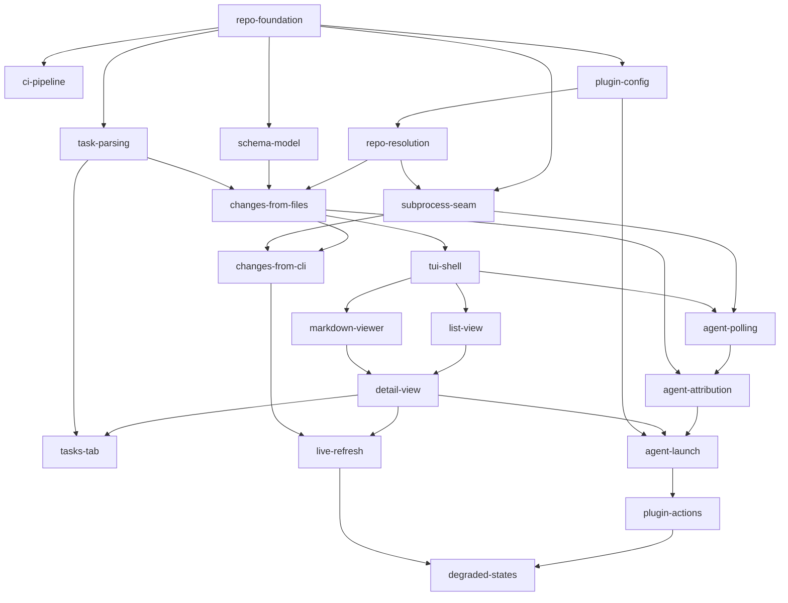

# Implementation Order

The roadmap from an empty scaffold to an installable Herdr plugin. Each row is one
OpenSpec change with its own proposal, specs, design, tasks, and planning-review under the
repository's `tdd` schema.

Read [SPEC.md](../SPEC.md) first — it is the contract every change below implements.
[PRD.md](../PRD.md) carries the requirements and the non-goals.

This is a plan, not a commitment. A change may split when its tasks turn out to carry
two kinds of work, or merge when a boundary proves imaginary. Update this file when
that happens rather than letting it drift.

## Ordering principles

- **Pure logic before the TUI.** Resolution, schema parsing, task parsing, and change
  loading are pure transformations with no terminal and no subprocess. They are built
  and fully tested before anything renders (SPEC → Architecture).
- **The subprocess seam exists before anything crosses it.** `OpenspecCli` and
  `HerdrCli` land as traits with fakes before the first change that shells out, so no
  test ever spawns a real process (SPEC → Architecture).
- **Files before the CLI.** The file-reading path is built first and stays the path
  that paints the pane. CLI enrichment is layered on top as an asynchronous
  correction, which keeps the fallback exercised on every launch rather than untested
  (SPEC → Data layer).
- **Dashboard before agents.** The plugin is useful the moment it can read a change.
  Agent awareness and launching are additive and land after the dashboard works.
- **Degrade at every step.** Each change handles its own empty and unavailable states
  as it goes; `degraded-states` closes the table rather than introducing the idea
  (PRD → Goal 5).
- **Dogfoodable from Phase 1.** `repo-foundation` ships a manifest that
  `herdr plugin link .` can load, so every later change can be seen running in a real
  pane.

---

## Phase 1 — Foundation

| Change | Scope | Spec refs | Depends on |
|---|---|---|---|
| `repo-foundation` | Cargo scaffold (binary `herdr-openspec`); `rustfmt.toml`; `Makefile` with a `check` target running format, lint, test, and coverage; `scripts/build.sh` sourcing `~/.cargo/env` before building; a minimal `herdr-plugin.toml` (`id`, `name`, `version`, `min_herdr_version`, `platforms`, `[[build]]`, the `dashboard` pane) so `herdr plugin link .` works from day one. | Build and distribution | — |
| `ci-pipeline` | GitHub Actions on `ubuntu-latest` and `macos-latest` with `Swatinem/rust-cache`. Required jobs: `cargo fmt --check`, `cargo clippy -D warnings`, `cargo test`. Coverage via `cargo llvm-cov --fail-under-lines 80`, Linux only. | Testing and quality gates | `repo-foundation` |
| `plugin-config` | Read `config.toml` from the directory Herdr injects as `HERDR_PLUGIN_CONFIG_DIR` (no subprocess; falls back to the same path `herdr plugin config-dir` reports when run outside a Herdr-started process): `openspec_bin`, `agent_kind`, `archived_count`. Absent file and absent keys fall back to defaults. Also the plugin-local state file — under `HERDR_PLUGIN_STATE_DIR`, separate from `config.toml` — that records the agent-name mapping whenever the derived name differs from the change name, not only when truncated. | Data layer → Resolution chain | `repo-foundation` |

## Phase 2 — Reading OpenSpec from disk

Pure transformations. No terminal, no subprocess, no writes.

| Change | Scope | Spec refs | Depends on |
|---|---|---|---|
| `repo-resolution` | `resolve` — walk up from a starting directory for `openspec/`, and the four-step `openspec` binary probe chain (config, `PATH`, nvm tree, `npm prefix -g`) with session caching. Step 4's `npm prefix -g` collaborator ships as an injected hook that always returns nothing; `subprocess-seam` replaces it. Tested against a purpose-built scratch directory tree, not a faked filesystem layer. | Data layer → Resolution chain | `plugin-config` |
| `schema-model` | `schema` — resolve the schema name from a change's own `.openspec.yaml`, then the project's `openspec/config.yaml` → `schema:`, then the default `spec-driven`; load `openspec/schemas/<name>/schema.yaml`; produce the ordered artifact list; and identify the tasks artifact by the schema's `apply.tracks` value, falling back to the id `tasks` when no `apply` block declares what it tracks. Carries a delta on `plugin-build`, since the change adds the crate's second dependency (`yaml-rust2`). | Data layer → Resolution chain | `repo-foundation` |
| `task-parsing` | `tasks` — parse a markdown task file into groups under their headings, items with checked state, and completion counts. | Data layer → Dual-source model (the counting-rule contract this change implements); User interface → Detail view (where `tasks-tab` later renders the result) | `repo-foundation`; its scratch-tree and containment tests also reuse `testutil::ScratchDir`/`testutil::snapshot` from `plugin-config`/`repo-resolution`, both already landed — no new Mermaid edge, since the dependency is on test *helpers* rather than a published contract |
| `changes-from-files` | `changes::from_files` — enumerate active changes from `openspec/changes/`, archived ones from `openspec/changes/archive/` (strip the `YYYY-MM-DD-` prefix, sort descending, take `archived_count`), and resolve each artifact's paths from its schema-declared `generates` value, never a path guessed from its id. Also consumes `Config::archived_count` from `plugin-config`, which reaches it transitively through `repo-resolution` and so adds no Mermaid edge below — noted so the absence is not read as an oversight. Produces the `Change` type the CLI path must also produce. | Data layer | `repo-resolution`, `schema-model`, `task-parsing` |

## Phase 3 — The subprocess seam

| Change | Scope | Spec refs | Depends on |
|---|---|---|---|
| `subprocess-seam` | `cli` — the `OpenspecCli` and `HerdrCli` traits, one real spawn-and-return-stdout implementation each, and the fakes used by every later test. No parsing lives here. Also replaces `resolve::npm_prefix_deferred` with a real binding that runs `npm prefix -g` behind the seam, reading its stdout only, trimmed — `npm` writes unrelated shell-plugin noise to stderr on the reference machine — and treating a non-zero exit or empty output as no prefix. This is an end-to-end obligation, not just a binding swap: a scenario must drive the real hook through to `<prefix>/bin/openspec`, since until this change lands that join is exercised only by fixture closures. | Architecture → The subprocess seam | `repo-foundation`, `repo-resolution` |
| `changes-from-cli` | `changes::from_cli` — parse `openspec list --json`, `openspec status --change <n> --json`, and `openspec instructions apply --change <n> --json` (for `contextFiles`) into the same `Change` type, plus the merge policy that layers CLI results over file results. A schema the CLI rejects falls back to the file result for that change. Inherits two obligations from `changes-from-files`: join the two producers' artifact lists by **position** in the schema's declared order, never by path or by id (`schema-artifacts` forbids de-duplicating ids, and file-sourced paths are not canonicalized while the CLI's `contextFiles` paths are, so the strings legitimately differ); and re-sort the CLI's active-change list by name, since `openspec list --json` defaults to most-recently-modified first and the two producers must agree on one order. Also owns the schema CLI-fallback tier: when `schema::load` reports `LoadError::NotVendored`, ask `openspec schema which <name> --json` for the schema's directory (stdout is clean JSON; an "experimental" note goes to stderr) and read `schema.yaml` from there with the same parser — this covers the `$XDG_DATA_HOME` and package-built-in tiers a disk-only read cannot see. No direct `schema-model --> changes-from-cli` edge is added to the graph below: `schema-model --> changes-from-files --> changes-from-cli` already transitively satisfies this obligation. | Data layer → Dual-source model | `changes-from-files`, `subprocess-seam` |

## Phase 4 — The dashboard

| Change | Scope | Spec refs | Depends on |
|---|---|---|---|
| `tui-shell` | crossterm terminal setup and teardown, the ratatui event loop, quit handling, the 100-column responsive breakpoint, and the `TestBackend` harness that later view changes assert against. | User interface → Responsive layout | `changes-from-files` |
| `list-view` | The change list: one row per active change with progress, the archived separator and rows below it, selection and navigation, and `/` filtering. Empty states for no repository and no changes. | User interface → List view | `tui-shell` |
| `markdown-viewer` | `pulldown-cmark` to ratatui text — headings, lists, code blocks, emphasis, links — with scrolling. | User interface → Detail view | `tui-shell` |
| `detail-view` | Change header (name, schema, progress), the artifact tab bar built from the schema's ordered artifacts, `1`–`9` / `[` / `]` tab switching, and the "No content yet" state for a missing artifact. | User interface → Detail view | `list-view`, `markdown-viewer` |
| `tasks-tab` | The tasks artifact rendered as grouped checkbox items with a progress bar, replacing the plain markdown view for that one tab. Read-only. | User interface → Detail view | `detail-view`, `task-parsing` |
| `live-refresh` | The `notify` watcher on `openspec/` with ~150ms debounce and per-change invalidation, the worker thread running CLI calls off the render path, and the `r` force-refresh key. This is where the dual-source model becomes visible: files paint, the CLI corrects. | Data layer → Refresh | `detail-view`, `changes-from-cli` |

## Phase 5 — Herdr integration

| Change | Scope | Spec refs | Depends on |
|---|---|---|---|
| `agent-polling` | Poll `herdr agent list` at ~1s and parse the result. An unreachable socket is a supported state, not an error: the plugin runs as a standalone TUI. | Herdr integration → Agent status by polling | `subprocess-seam`, `tui-shell` |
| `agent-attribution` | Map live agents onto changes across the three tiers — launched by the plugin, named to match a change, and neither — plus the footer count for agents in the repository that are deliberately not attributed. Renders the badge on the list row. | Herdr integration → Attributing an agent | `agent-polling`, `changes-from-files` |
| `agent-launch` | `a` / `c` / `s` launch an agent: `herdr pane split --cwd`, then `herdr agent start <change> --kind <kind> --pane <id>`, then `herdr agent prompt` with the `/opsx:*` command. Names longer than 32 characters are truncated and recorded. `g` focuses an existing agent. Action keys hidden when the socket is unreachable. | Herdr integration → Launch flow | `agent-attribution`, `detail-view`, `plugin-config` |

## Phase 6 — Packaging

| Change | Scope | Spec refs | Depends on |
|---|---|---|---|
| `plugin-actions` | The `open` and `open-tab` binary subcommands that open or focus the dashboard pane via `herdr plugin pane`, and the manifest entries that go with them: both `[[actions]]` and the `dashboard-tab` pane. (`min_herdr_version` and `platforms` ship in `repo-foundation`, not here.) | Herdr integration → Manifest | `agent-launch` |
| `degraded-states` | Close the degraded-states table end to end: audit every row against the running plugin, add the `file mode` header badge, and cover each state with a view test. Nothing here should be new behaviour — this change exists to prove the table is true. | Degraded states | `plugin-actions`, `live-refresh` |

## Dependencies

## Notes on the ordering

**`plugin-config` before `repo-resolution`.** The binary probe chain starts with a
configured path, so configuration has to be readable before resolution can be written
against its real first step rather than a stub.

**`changes-from-files` before `changes-from-cli`, and both before the TUI.** The file
path is not a fallback bolted on afterwards — it is what paints the pane. Building it
first, and building the CLI path to produce the same `Change` type, is what makes the
dual-source model hold rather than becoming two divergent readers.

**`tui-shell` depends on `changes-from-files`, not on the CLI.** The dashboard is
useful, testable, and dogfoodable with no `openspec` binary present at all. That
dependency edge is the one that keeps "never fail closed" honest.

**`markdown-viewer` and `list-view` are siblings.** Nothing connects them until
`detail-view`, so they can be built in parallel.

**`agent-polling` before `agent-attribution` before `agent-launch`.** Reading agent
state, deciding what it means, and acting on it are three separable risks. Attribution
is the one most likely to need revision after real use, and it sits alone.

**`degraded-states` last, and deliberately additive-free.** Every earlier change
handles its own empty states. If this change discovers new behaviour rather than
confirming existing behaviour, an earlier change was incomplete.
